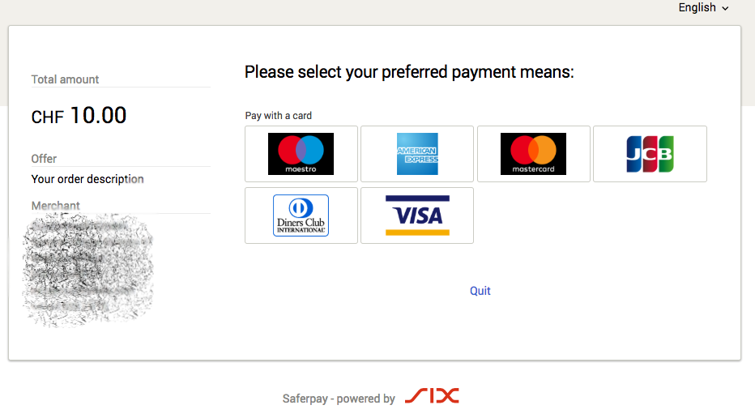
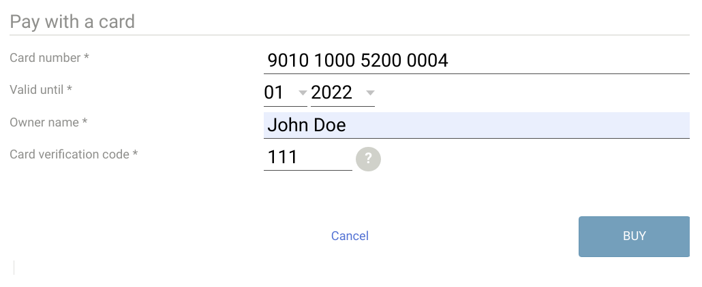

# Saferpay Payum Plugin

[](https://travis-ci.org/karser/PayumSaferpay)
[](https://scrutinizer-ci.com/g/karser/PayumSaferpay/?branch=master)
[](https://scrutinizer-ci.com/g/karser/PayumSaferpay/?branch=master)
[](https://packagist.org/packages/karser/payum-saferpay)

## Introduction

This plugin implements [Saferpay specification v1.10](https://saferpay.github.io/jsonapi/index.html), including all features from e-commerce and business licenses.
Saferpay e-commerce license provides access to Payment Page interface only.
Saferpay Business license provides Transaction Interface, [recurring payments](https://saferpay.github.io/sndbx/recurring.html), storing cards aliases and etc.
For more detailed comparison please refer to [this](https://saferpay.github.io/sndbx/Interfaces.html) page.

Transaction Interface provides two options: an iframe (similar to Payment Page) and submitting the card data
directly. The last option is available only if you are PCI compliant.

Here is how Payment Page interface looks like:


Here is how Transaction interface looks like:


## Requirements

- PHP 7.2+
- [Payum](https://github.com/Payum/Payum)
- Optionally [PayumBundle](https://github.com/Payum/PayumBundle) and Symfony 3 or 4+

## Features

This plugin supports

- [Payment Page interface](https://saferpay.github.io/sndbx/Integration_PP.html)
- [Transaction interface](https://saferpay.github.io/sndbx/Integration_trx.html)
- Recurring Payments [with the referenced transactions Method](https://saferpay.github.io/sndbx/recurring.html#recurring-referenced)
- Recurring Payments [using an alias](https://saferpay.github.io/sndbx/recurring.html#recurring-alias)
- Aliases support: Add and remove, Capture transaction
- Specifying LIABILITY_SHIFT condition (payment will not be accepted if LiabilityShift is not possible)
- Handling payment notification for Payment Page interface

All features are covered with tests. You can find useful examples in functional tests.

## Installation

```bash
$ composer require trackmage/payum-saferpay
```

## Configuration

### With PayumBundle (Symfony)

First register the gateway factory in your services definition:
```yaml
# config/services.yaml or app/config/services.yml
services:
    app.saferpay.gateway_factory:
        class: Payum\Core\Bridge\Symfony\Builder\GatewayFactoryBuilder
        arguments: [Karser\PayumSaferpay\SaferpayGatewayFactory]
        tags:
            - { name: payum.gateway_factory_builder, factory: saferpay }
```

Then configure the gateway:

You can use `General test account` credentials or create personal test account
[here](https://www.six-payment-services.com/en/site/e-commerce/support/testaccount.html)

```yaml
# config/packages/payum.yaml or app/config/config.yml

payum:
    gateways:
        saferpay:
            factory: saferpay
            # this is test credentials
            username: 'API_401860_80003225'
            password: 'C-y*bv8346Ze5-T8'
            customerId: '401860'
            terminalId: '17795278'
            interface: 'TRANSACTION' #optionally, can be defined via details too
            sandbox: true
            iframeCssUrl: 'https://acme.com/hosted-page-styles.css'
```

### With Payum

```php
<?php
//config.php

use Payum\Core\GatewayFactoryInterface;
use Payum\Core\PayumBuilder;
use Payum\Core\Payum;
use Karser\PayumSaferpay\SaferpayGatewayFactory;

/** @var Payum $payum */
$payum = (new PayumBuilder())
    ->addDefaultStorages()
    ->addGatewayFactory('saferpay', static function(array $config, GatewayFactoryInterface $coreGatewayFactory) {
        return new SaferpayGatewayFactory($config, $coreGatewayFactory);
    })
    ->addGateway('saferpay', [
        'factory' => 'saferpay',
        # this is test credentials
        'username' => 'API_401860_80003225',
        'password' => 'C-y*bv8346Ze5-T8',
        'customerId' => '401860',
        'terminalId' => '17795278',
        'interface' => 'TRANSACTION', #optionally, can be defined via details too
        'sandbox' => true,
    ])
    ->getPayum()
;
```

### Configure the routes

You can include the default Payum Bundle's routes, although
only these routes are actually required by this plugin:
  
```yaml
#config/routes.yaml
payum_capture_do:
    path: /payment/capture/{payum_token}
    controller: PayumBundle:Capture:do

#notification route is required only if you use payment page interface
#payum_notify_do:
#    path: /payment/notify/{payum_token}
#    controller: PayumBundle:Notify:do
```

## Usage

### Capture example

Make sure you defined `Payment` and `Token` entities like it is described [here](https://github.com/Payum/Payum/blob/master/docs/storages.md)


```php
<?php
//capture.php

use App\Entity\Payment;
use Payum\Core\Payum;
use Payum\Core\Request\Capture;
use Karser\PayumSaferpay\Constants;

/** @var Payum $payum */
$storage = $payum->getStorage(Payment::class);
$payment = $storage->create();
$payment->setNumber(uniqid());
$payment->setCurrencyCode('USD');
$payment->setTotalAmount(123); //$1.23 USD
$payment->setDescription('test payment');

// capture using TRANSACTION interface (default)
$payment->setDetails(['Interface' => Constants::INTERFACE_TRANSACTION]);
// or capture using PAYMENT_PAGE interface
$payment->setDetails(['Interface' => Constants::INTERFACE_PAYMENT_PAGE]);

$storage->update($payment);

$token = $payum->getTokenFactory()->createCaptureToken('saferpay', $payment, 'done.php');

$captureRequest = new Capture($token);
$captureRequest->setModel($payment);
$reply = $this->gateway->execute($captureRequest, true);

//then redirect user to $reply->getUrl();
```

```php
<?php
//done.php

use App\Entity\Payment;
use Payum\Core\Payum;
use Payum\Core\Request\GetHumanStatus;

/** @var Payum $payum */
$token = $payum->getHttpRequestVerifier()->verify($_GET);
$this->payum->getHttpRequestVerifier()->invalidate($token);

$payment = $payum->getStorage(Payment::class)->find($token);

$this->assertStatus(GetHumanStatus::STATUS_CAPTURED, $payment);

$this->gateway->execute($status = new GetHumanStatus($payment));

//status of the payment is in $status->getValue()
```

### Recurring Payments with the referenced transactions Method

1. Capture payment with Recurring or Installment option:

```php
use Karser\PayumSaferpay\Constants;


$payment = $storage->create();

$payment->setDetails(['Payment' => ['Recurring' => ['Initial' => true]]]);
//or
$payment->setDetails(['Payment' => ['Installment' => ['Initial' => true]]]);

//then capture the payment
$captureRequest = new Capture($token);
$captureRequest->setModel($payment);
$reply = $this->gateway->execute($captureRequest, true);
//then redirect user to $reply->getUrl();

```

2. Capture a new transaction by providing a reference to the previous one:
```php
$refTransactionId = $payment->getDetails()['Transaction']['Id'];

$payment = $storage->create();

$payment->setDetails([
    'TransactionReference' => [
        'TransactionId' =>  $refTransactionId,
    ]
]);

//then capture the payment
$captureRequest = new Capture($token);
$captureRequest->setModel($payment);
$this->gateway->execute($captureRequest);
```

### Recurring Payments using an alias

1. Obtaining the Alias:
The user will have to enter their card details in an iframe.

```php
use Karser\PayumSaferpay\Constants;
use Karser\PayumSaferpay\Model\CardAlias;


$cardAliasStorage = $this->payum->getStorage(CardAlias::class);
$alias = $cardAliasStorage->create();
$alias->setDetails([
    'Alias' => [
        'IdGenerator' => Constants::ALIAS_ID_GENERATOR_MANUAL,
        'Id' => $generatedId = uniqid('id', true),
        'Lifetime' => 1600, //days
    ]
]);
$this->cardAliasStorage->update($alias);
$token = $this->payum->getTokenFactory()->createCaptureToken(self::GATEWAY_NAME, $cardAlias, 'done.php');

$insertCardAliasRequest = new InsertCardAlias($token);
$insertCardAliasRequest->setModel($cardAlias);
$reply = $this->gateway->execute($insertCardAliasRequest, true);
//then redirect user to $reply->getUrl();
```

2. Capture a new transaction by providing an alias id:
```php
$aliasId = $cardAlias->getDetails()['Alias']['Id'];

$payment = $storage->create();

$payment->setDetails([
    'PaymentMeans' => [
        'Alias' => [
            'Id' => $aliasId,
        ],
    ],
]);

//then capture the payment
$captureRequest = new Capture($token);
$captureRequest->setModel($payment);
$this->gateway->execute($captureRequest);
```

## Testing

```
composer update
vendor/bin/phpunit
```


## TODO:
- Implement separate actions: Authorize, Cancel transaction
- Improve and add more unit tests
- config parameters: language, LIABILITY_SHIFT condition, payer note


## Credits
- Dmitrii Poddubnyi <dpoddubny@gmail.com>

## License

This plugin is under the MIT license.  
For the whole copyright, see the [LICENSE](LICENSE) file distributed with this source code.
